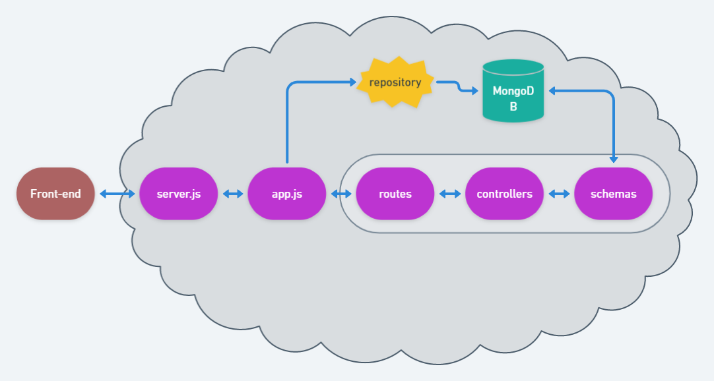

# nodejs-contatinhos

Desafio da semana 14 do curso de backend da [{reprograma}](https://github.com/reprograma), baseado no [repositório](https://github.com/reprograma/on6-xp-s14-projeto-3).

## Endpoints

- [x]  **"/"** Retorna index com apresentação
{
   mensagem: bem vinda a lista de contatinhos
}
- [x]  **"/contatos/"** Retorna todos os dados do banco de dados
- [x]  "**/contatos/criar**" Cria novo contato e retorna mensagem amigável
- [x]  "**/contatos/**nome/[NOME]" Retorna contato por nome específico
- [x]  "**/contatos/**id/[ID]" Retorna contato por id específico
- [x]  "/contatos/deletar/[ID]" Deleta contato por id específico e retorna mensagem amigávele retorna mensagem amigável (i
- [x]  "/contatos/atualizar/telefone/[ID]" Atualiza somente telefone do contato por id específico e retorna mensagem amigável
- [x]  "/contatos/atualizar/[ID]" Atualiza completamente contato e retorna mensagem amigável (id não pode ser modificado)

## Arquitetura MVC

```bash
\--📂 nodejs-contatinhos
    |   .gitignore
    |   package-lock.json
    |   package.json
    |   server.js
    \--📂 node_modules
    \--📂 src
	|   app.js
	|
	📂---controllers
	 |       contatosController.js
	 |
	📂---model
	 |       contatoSchema.js
	 |	 repository.js
	 |
	📂---routes
		 contatosRoute.js
		 index.js
```



## Iniciar API

`npm install && npm start`
